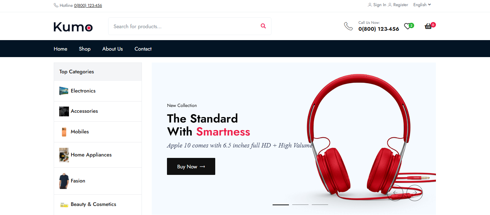
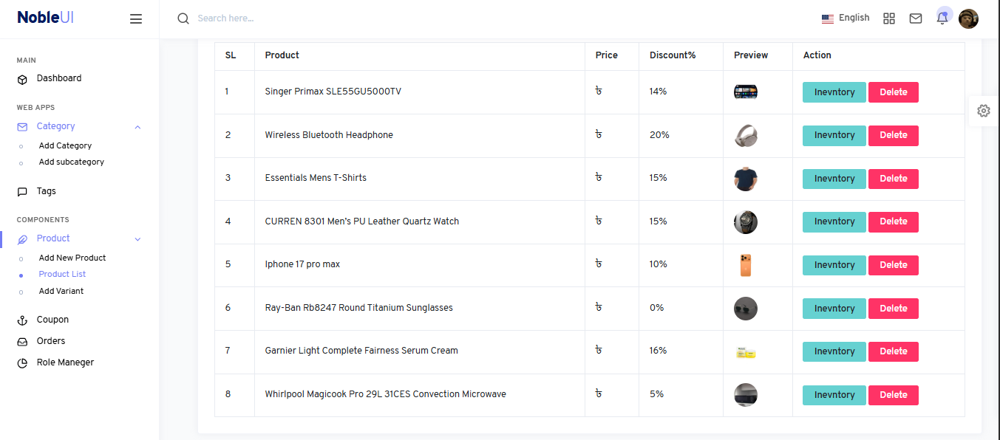
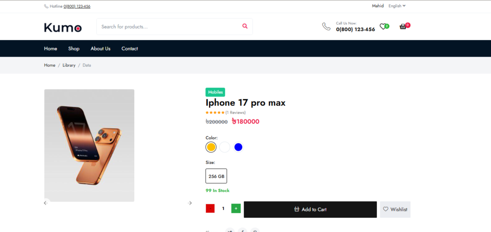
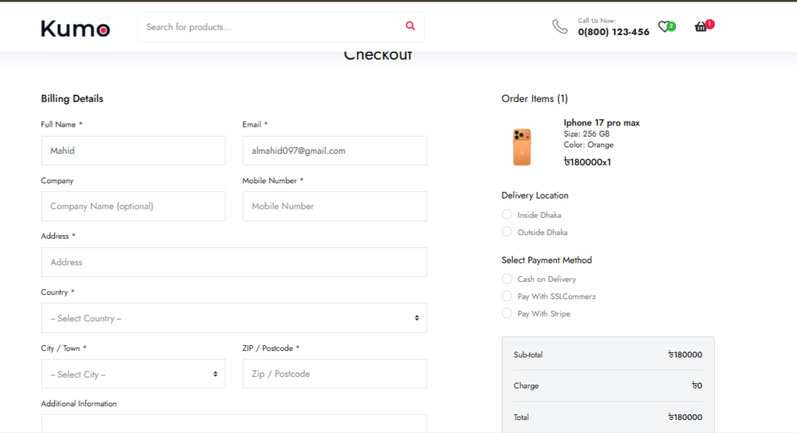

# 🛒 E-Commerce with Admin Dashboard


<br/>

> A full-featured E-Commerce platform with a powerful Admin Dashboard built with Laravel & Bootstrap.

---

## 📸 Screenshots

### 🏠 Homepage


### 🖥️ Admin Dashboard


### 🛍️ Product Page


### 💳 Checkout Page


---

## ✨ Features

### 🛠️ Admin Dashboard
- ✅ Manage Products, Categories, and Inventory
- ✅ Order Management System
- ✅ Role & Permission (Admin/User)
- ✅ Dynamic Banner & Content Management

### 🛍️ Customer Experience
- ✅ Product Browsing & Filtering
- ✅ Add to Cart & Wishlist
- ✅ Review & Rating System
- ✅ Secure Checkout Process

### 💳 Payment Integration
- ✅ SSLCommerz Payment Gateway
- ✅ Stripe Payment Gateway
- ✅ Cash on Delivery
- ✅ Order Success / Failed / Cancel Handling

### 📦 Order Flow
```
Cart → Checkout → Payment → Order Confirmation
```
- ✅ Real-time Order Status Handling

---

## 🛠️ Tech Stack


---

## ⚙️ Installation

```bash
# Repository clone করুন
git clone https://github.com/mahid36/E-commerce-with-admin-dashboard.git

# Project folder এ যান
cd E-commerce-with-admin-dashboard

# Dependencies install করুন
composer install
npm install

# .env file setup করুন
cp .env.example .env
php artisan key:generate

# Database migrate করুন
php artisan migrate --seed

# Server run করুন
php artisan serve
```

---

## 🔐 Admin Access

```
URL      : http://127.0.0.1:8000/admin
Email    : admin@example.com
Password : password
```

---

## 📁 Project Structure

```
├── app/
│   ├── Http/Controllers/
│   ├── Models/
├── resources/
│   ├── views/
│   │   ├── frontend/
│   │   ├── admin/
├── routes/
│   ├── web.php
├── screenshots/
├── database/
│   ├── migrations/
└── README.md
```

---

## 🤝 Contributing

Pull requests are welcome! For major changes, please open an issue first.

---

## 📄 License

This project is open source and available under the [MIT License](LICENSE).

---

## 👨‍💻 Author

**Mahid**
[](https://github.com/mahid36)
